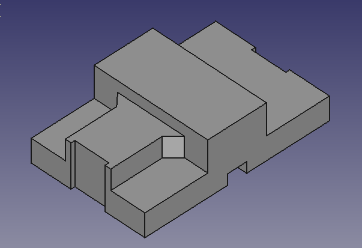

# Objetos 3d para amigos

Repositorio de piezas que vaya modelando para peticiones de amig@s.

 

## Instrucciones

Ir a [aquí](https://github.com/crdguez/3d_things_for_friends?files=1). En la carpeta correspondiente a la pieza aparecerá:

- la fuente en **FreeCad** por si se quiere modificar y/o mejorar (fichero **.fcstd**)
- el modelo en estándar **STEP** por si se quiere importar desde otro programa de modelado que no sea FreeCad (fichero **.step**)
- la malla de puntos 3D en formato estándar **STL** para poder materializarse con impresoras 3d, máquinas de mecanizado, etc. (fichero **.stl**)

## Licencia
  
[Creative Commons Attribution-ShareAlike 4.0 International License](http://creativecommons.org/licenses/by-sa/4.0/)
